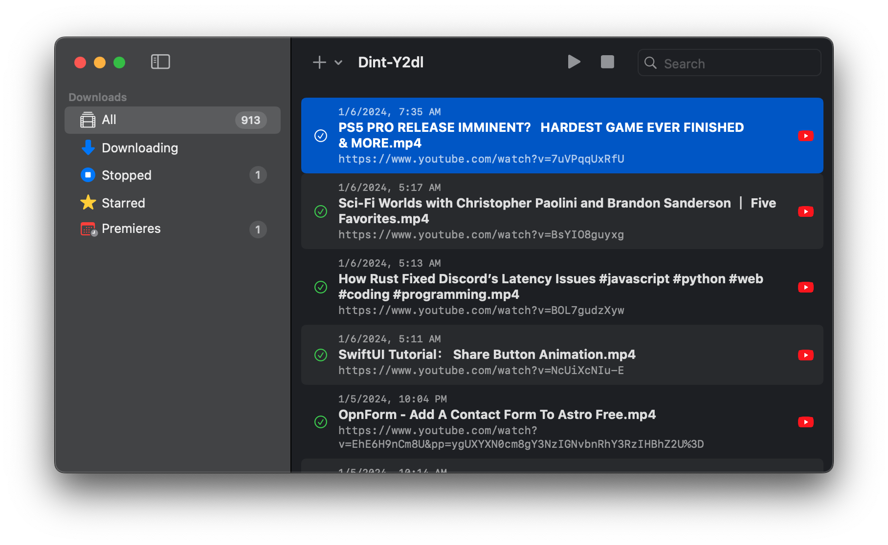

    
    <h1 align="center"><code style="text-shadow: 0px 3px 10px rgba(8, 0, 6, 0.35); font-size: 3rem; font-family: ui-monospace, Menlo, monospace; font-weight: 800; background: transparent; color: #4d3e56; padding: 0.2rem 0.2rem; border-radius: 6px">Dint-Y2dl</code></h1>
    <h4 align="center" style="padding: 0; margin: 0; font-family: ui-monospace, monospace;">macOS yt-dlp GUI app for video sites downloading</h4>

<a href="https://dintapps.com/">Website</a> ·
<a href="https://github.com/DintApps/Dint-Y2dl/releases">Releases</a>

---

## About

[Dint-Y2dl](https://dintapps.com/dint-y2dl) is a free macOS GUI app of [yt-dlp](https://github.com/yt-dlp/yt-dlp/).

## Requirment

macOS 14.0+

## Download

[Download latest release](https://github.com/DintApps/Dint-Y2dl/releases/latest/download/Dint-Y2dl.dmg)

## Support my work

